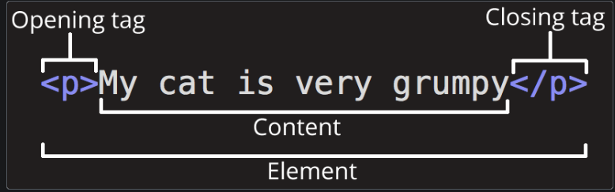

HTML is the technology that defines the content and structure of any website. Written properly, it should also define the semantics (meaning) of the content in a machine-readable way, which is vital for accessibility, search engine optimization, and making use of the built-in features browsers provide for content to work optimally. This module covers the basics of the language, before looking at key areas such as document structure, links, lists, images, forms, and more.

BASIC HTML SYNTAX

Covers the absolute basics of HTML, to get you started — we define elements, attributes, and other important terms, and show where they fit in the language. We also show how a typical HTML page is structured and how an HTML element is structured, and explain other important basic language features. Along the way, we'll play with some HTML to get you interested!

What is HTML
HTML (HyperText Markup Language) is a markup language that tells web browsers how to structure the web pages you visit. It can be as complicated or as simple as the web developer wants it to be. HTML consists of a series of elements, which you use to enclose, wrap, or mark up different parts of content to make it appear or act in a certain way. The enclosing tags can make content into a hyperlink to connect to another page, italicize words, and so on. For example, consider the following line of text:   
My cat is very grumpy

HTML lives inside text files called HTML documents, or just documents, with a .html file extension. Where previously we've talked about web pages, an HTML document contains the web page's content and specifies its structure.

The most common HTML file you'll encounter is index.html, which is generally used to contain a website's home page content. It's also common to see subfolders with their own index.html, so a website can have multiple index files in different places.

Note: Tags in HTML are not case-sensitive. This means they can be written in uppercase or lowercase. For example, a <title> tag could be written as <title>, <TITLE>, <Title>, <TiTlE>, etc., and it will work. However, it is best practice to write all tags in lowercase for consistency and readability.

Anatomy of an html element

The anatomy of our element is:

The opening tag: This consists of the name of the element (in this example, p for paragraph), wrapped in opening and closing angle brackets. This opening tag marks where the element begins or starts to take effect. In this example, it precedes the start of the paragraph text.
The content: This is the content of the element. In this example, it is the paragraph text.
The closing tag: This is the same as the opening tag, except that it includes a forward slash before the element name. This marks where the element ends. Failing to include a closing tag is a common beginner error that can produce peculiar results.
The element is the opening tag, followed by content, followed by the closing tag.

Atrributes:

Attributes contain extra information about the element that won't appear in the content. In this example, the class attribute is an identifying name used to target the element with style information.

An attribute should have:

A space between it and the element name. (For an element with more than one attribute, the attributes should be separated by spaces too.)
The attribute name, followed by an equal sign.
An attribute value, wrapped with opening and closing quote marks.

Adding Attributes to an element Now it's your turn again. In this section we are going to get you to add attributes to an  element to get an image displaying on the page. The  element can take several attributes, including:

src: A required attribute that specifies the location of the image. For example: src="https://raw.githubusercontent.com/mdn/beginner-html-site/gh-pages/images/firefox-icon.png".
alt: A text description of the image. For example: alt="The Firefox icon".
width: The width of the image in pixels. For example: width="300".
height: The height of the image in pixels. For example: height="300".

Boolean attributes 

Sometimes you will see attributes written without values. This is entirely acceptable. These are called Boolean attributes. When a boolean attribute is written without a value, or with any value, even like "false", the boolean attribute is always set to true. Otherwise, if the attribute is not written in an HTML tag, the attribute is set to false. The spec requires the attribute's value to either be the empty string (including when the attribute has no value explicitly specified) or the same as the attribute's name, but other values work the same. For example, consider the disabled attribute, which you can assign to form input elements. (You use this to disable the form input elements so the user can't make entries. The disabled elements typically have a grayed-out appearance.) For example: <input type="text" disabled="disabled" />

Omitting quotes around attribute values
If you look at code for a lot of other sites, you might come across a number of strange markup styles, including attribute values without quotes. This is permitted in certain circumstances, but it can also break your markup in other circumstances. The element in the code snippet below, <a>, is called an anchor. Anchors enclose text and turn them into links. The href attribute specifies the web address the link points to. You can write this basic version below with only the href attribute, like this:<a href=https://www.mozilla.org/ title=The Mozilla homepage>favorite website</a>
As written above, the browser misinterprets the markup, mistaking the title attribute for three attributes: a title attribute with the value The, and two Boolean attributes, Mozilla and homepage. Obviously, this is not intended! It will cause errors or unexpected behavior, as you can see in the live example below. Try hovering over the link to view the title text!

In this article, you will also notice that the attributes are wrapped in double quotes. However, you might see single quotes in some HTML code. This is a matter of style. You can feel free to choose which one you prefer. Both of these lines are equivalent:
Single or double quotes?
<a href='https://www.example.com'>A link to my example.</a>

<a href="https://www.example.com">A link to my example.</a>

Anatomy of an HTML document
Individual HTML elements aren't very useful on their own. Next, let's examine how individual elements combine to form an entire HTML page:
<!doctype html>
<html lang="en-US">
  <head>
    <meta charset="utf-8" />
    <title>My test page</title>
  </head>
  <body>
    
This is my page

  </body>
</html>

Here we have:

<!doctype html>: The doctype. When HTML was young (1991-1992), doctypes were meant to act as links to a set of rules that the HTML page had to follow to be considered good HTML. Doctypes used to look something like this:

html

Copy
<!doctype html PUBLIC "-//W3C//DTD XHTML 1.0 Transitional//EN" "http://www.w3.org/TR/xhtml1/DTD/xhtml1-transitional.dtd">
More recently, the doctype is a historical artifact that needs to be included for everything else to work right. <!doctype html> is the shortest string of characters that counts as a valid doctype. That is all you need to know!

<html></html>: The <html> element. This element wraps all the content on the page. It is sometimes known as the root element.

<head></head>: The <head> element. This element acts as a container for everything you want to include on the HTML page, that isn't the content the page will show to viewers. This includes keywords and a page description that would appear in search results, CSS to style content, character set declarations, and more. You will learn more about this in the next article of the series.

<meta charset="utf-8">: The <meta> element. This element represents metadata that cannot be represented by other HTML meta-related elements, like <base>, <link>, <script>, <style> or <title>. The charset attribute specifies the character encoding for your document as UTF-8, which includes most characters from the vast majority of human written languages. With this setting, the page can now handle any textual content it might contain. There is no reason not to set this, and it can help avoid some problems later.

<title></title>: The <title> element. This sets the title of the page, which is the title that appears in the browser tab the page is loaded in. The page title is also used to describe the page when it is bookmarked.

<body></body>: The <body> element. This contains all the content that displays on the page, including text, images, videos, games, playable audio tracks, or whatever else.

Adding some features to an HTML document
At this point, we want you to practice writing some slightly more substantial HTML content. To do this, you've got a couple of options — you can create the HTML on your local computer, or use the MDN Playground like in the previous examples.

To do it on your local machine:

Copy the HTML page example listed in the previous section and paste it into a new file in your code editor.
Make the changes to the page outlined in the instructions below.
Save the file as index.html then load it in a new browser tab to see the results.